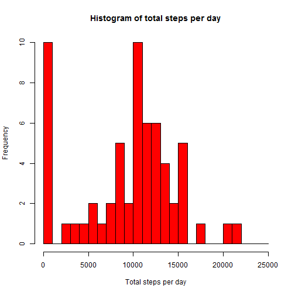

# Reproducible Research: Peer Assessment 1
Melissa Berkheimer


##Abstract
This document examines the movement data of one individual at 5 minute increments 
between the period of October 1st and November 30th 2010. 


###Retrieving data

The data was read into R from the file "activity.csv".  "activity.csv" contained 17568 observations and consisted of three variables: two intergers, steps and interval, and a factor, date, with
61 levels. The levels were saved as a vector and the class of the date variable was changed to character. 


```r
setwd("D:/R files/Reproducible Research/prog 1")
dat <- read.csv("activity.csv", sep = ",")
datDate<- transform(dat, date = as.character(date))
dates <- levels(dat[,2])
```

To aid in analysis the stringr library was loaded.


```r
library(stringr)
```


##Total number of steps taken per a day

Steps were counted for a total of 61 days.  


```r
        ##create empty data.frame
        stepsDay <-data.frame(matrix(vector(), 61, 2, 
                dimnames=list(c(), c("Date", "Total steps"))),
                stringsAsFactors=F)

        ##loop through all dates
        for (i in 1:61){
                stepsDay[i,1] <- as.character(dates[i], format = "%Y-%m-%d")
                x <- datDate[which(datDate$date == dates[i]),1]
                stepsDay[i,2] <- sum(x, na.rm = T)
        }
```

The histogram below shows the frequency of the total number of steps taken per a day.
The large 0 step value was attributted to days were the steps data values were missing or not recorded.


```r
        x <- seq(0, 25000, 1000)
        hist(stepsDay[,2],col = "red", breaks = x, 
             main = "Histogram of total steps per day", 
             xlab = "Total steps per day")
```

 

The median and mean total step counts were found to be:


```r
        medianSteps <- summary(stepsDay)[3,2]
        meanSteps <- summary(stepsDay)[4,2]
        medianSteps
```

```
## [1] "Median :10395  "
```

```r
        meanSteps
```

```
## [1] "Mean   : 9354  "
```


##Activity through out the day

Each day was split into a total of 288 five minute intervals. The activity across each time interval was averaged to show the user's pattern of activity.


```r
##create empty data.frame
stepsTime <-data.frame(matrix(vector(), 288, 2, 
                dimnames=list(c(), c("Time", "Average steps"))),
                stringsAsFactors=F)
j <- 0

##loop through all dates
for (i in seq(0, 2355, 5)){
        x1 <- as.character(i)
        x2 <- as.numeric(str_sub(x1,-2,-1))
        if (x2 < 60){
                j <- j + 1
                stepsTime[j,1] <- i
                y <- dat[which(dat$interval == as.integer(i)),1]
                stepsTime[j,2] <- sum(y, na.rm = T)/61
        }
}
```

The average number of steps taken was plotted against the time of day.


```r
##Create a time series plot of 5 minute intervals(x) and
        ##the avg. no. of steps taken avg.ed across all days(y)
        plot(x = stepsTime[,1], y = stepsTime[,2], 
             type = "l", col = "red",
             main = "Average No. of steps taken vs. Time interval", 
             ylab = "Average No. of steps taken",
             xlab = "Time interval")
```

 


```r
##Which of the 5 min intervals contains the maximum number of steps?
        maxSteps <- max(stepsTime[,2])
        maxTime <- stepsTime[which(stepsTime[,2] == maxSteps),1]
        ##maxSteps
        ##maxTime
```

The maximium number of steps was found to be 179.1311 at 835.


##Inputing missing values

The histogram above shows a large number of "0" step days.  Several of these days can be attributted to missing data values.  To give a more accurate snapshot of the user's activity these values were approximated from the average step data of the affected time intervals.


```r
##find total no. missing values in dat, fill in w/ avg steps per interval
filledIn <- dat

missing <- 0
for (i in 1:17568){
        if (!complete.cases(dat[i,]) == T){        
                missing <- missing + 1
                interval <- as.numeric(dat[i,3])
                filledIn[i,1] <- stepsTime[which(stepsTime[,1] == interval),2]
        }
}
filledIn<- transform(filledIn, date = as.character(date))
```

The number of missing values was found to be 2304.

The new data was then used to create a new histogram, shown below.  Time intervals that reported "0" instead of Na were left unadulterated, resulting in a 2 "0" step days.


```r
##make a new histogram of total steps/day

##create empty data.frame
stepsDay2 <-data.frame(matrix(vector(), 61, 2, 
                dimnames=list(c(), c("Date", "Total steps"))),
                stringsAsFactors=F)

##loop through all dates
for (i in 1:61){
        stepsDay2[i,1] <- as.character(dates[i], format = "%Y-%m-%d")
        x <- filledIn[which(filledIn$date == dates[i]),1]
        stepsDay2[i,2] <- sum(x, na.rm = T)
}

##plot histogram
x <- seq(0, 25000, 1000)
hist(stepsDay2[,2],col = "red", breaks = x, 
     main = "Histogram of total steps per day, completed data", 
     xlab = "Total steps per day")
```

 

The new median and mean were found to be:


```r
## return mean, median no. of steps/day
summary(stepsDay2)[3,2]
```

```
## [1] "Median :10395  "
```

```r
summary(stepsDay2)[4,2]
```

```
## [1] "Mean   :10581  "
```

##Weekday vs. weekend activity

The completed data set was sorted according to day of the week.  The average steps for each time interval were then recalculated and plotted based on being either a weekday or a weekend.


```r
##factor filledin via weekend vs weekdays
filledInDate <- transform(filledIn, date = as.Date(date))
dayWeek <- weekdays(filledInDate$date, abbreviate = F)
filledIn2 <- cbind(filledIn,dayWeek)

##split filledIn2

filledIn4 <- split(filledIn2, filledIn2$dayWeek)

Saturday <- filledIn4$Saturday
Sunday <- filledIn4$Sunday
Monday <- filledIn4$Monday
Tuesday <- filledIn4$Tuesday
Wednesday <- filledIn4$Wednesday
Thursday <- filledIn4$Thursday
Friday <- filledIn4$Friday
```


```r
## Weekend
## create weekend df

weekend <-data.frame(matrix(vector(), 288, 2, 
                dimnames=list(c(), c("Time", "Average steps"))),
                stringsAsFactors=F)

##loop through Saturdays, Sundays
##Saturday
j <- 0
for (i in seq(0, 2355, 5)){
        x1 <- as.character(i)
        x2 <- as.numeric(str_sub(x1,-2,-1))
        if (x2 < 60){
                j <- j + 1
                weekend[j,1] <- i
                y <- Saturday[which(Saturday$interval == as.integer(i)),1]
                a <- sum(y, na.rm = T)/9
                weekend[j,2] <- a
        }
}
##Sunday
j <- 0
for (i in seq(0, 2355, 5)){
        x1 <- as.character(i)
        x2 <- as.numeric(str_sub(x1,-2,-1))
        if (x2 < 60){
                j <- j + 1
                y <- Sunday[which(Sunday$interval == as.integer(i)),1]
                a <- sum(y, na.rm = T)/9
                weekend[j,2] <- weekend[j,2] + a
        }
}
```


```r
## Weekday
##create an empty df, weekday

weekday <-data.frame(matrix(vector(), 288, 2, 
                dimnames=list(c(), c("Time", "Average steps"))),
                stringsAsFactors=F)
##loop thru M,T,W,Th,F
##Monday
j <- 0
for (i in seq(0, 2355, 5)){
        x1 <- as.character(i)
        x2 <- as.numeric(str_sub(x1,-2,-1))
        if (x2 < 60){
                j <- j + 1
                weekday[j,1] <- i
                y <- Monday[which(Monday$interval == as.integer(i)),1]
                a <- sum(y, na.rm = T)/9
                weekday[j,2] <- a
        }
}
##Tuesday
j <- 0
for (i in seq(0, 2355, 5)){
        x1 <- as.character(i)
        x2 <- as.numeric(str_sub(x1,-2,-1))
        if (x2 < 60){
                j <- j + 1
                y <- Tuesday[which(Tuesday$interval == as.integer(i)),1]
                a <- sum(y, na.rm = T)/9
                weekday[j,2] <- weekday[j,2] + a
        }
}
##Wednesday
j <- 0
for (i in seq(0, 2355, 5)){
        x1 <- as.character(i)
        x2 <- as.numeric(str_sub(x1,-2,-1))
        if (x2 < 60){
                j <- j + 1
                y <- Wednesday[which(Wednesday$interval == as.integer(i)),1]
                a <- sum(y, na.rm = T)/8
                weekday[j,2] <- weekday[j,2] + a
        }
}
##Thursday
j <- 0
for (i in seq(0, 2355, 5)){
        x1 <- as.character(i)
        x2 <- as.numeric(str_sub(x1,-2,-1))
        if (x2 < 60){
                j <- j + 1
                y <- Thursday[which(Thursday$interval == as.integer(i)),1]
                a <- sum(y, na.rm = T)/8
                weekday[j,2] <- weekday[j,2] + a
        }
}
##Friday
j <- 0
for (i in seq(0, 2355, 5)){
        x1 <- as.character(i)
        x2 <- as.numeric(str_sub(x1,-2,-1))
        if (x2 < 60){
                j <- j + 1
                y <- Friday[which(Friday$interval == as.integer(i)),1]
                a <- sum(y, na.rm = T)/9
                weekday[j,2] <- weekday[j,2] + a
        }
}
```

The plot below shows the average number of steps per vs time.  The weekdays show a large amount of activity in the morning.  The weekends show a greater amount of activity throughout the day.


```r
##plot weekend, weekday in a panel plot
par(mfrow = c(2,1))

plot(x = weekday[,1], y = weekday[,2], 
     type = "l", col = "red",
     main = "Weekdays", 
     ylab = "Average No. of steps taken",
     xlab = "Time interval")

plot(x = weekend[,1], y = weekend[,2], 
     type = "l", col = "blue",
     main = "Weekends", 
     ylab = "Average No. of steps taken",
     xlab = "Time interval")
```

 

